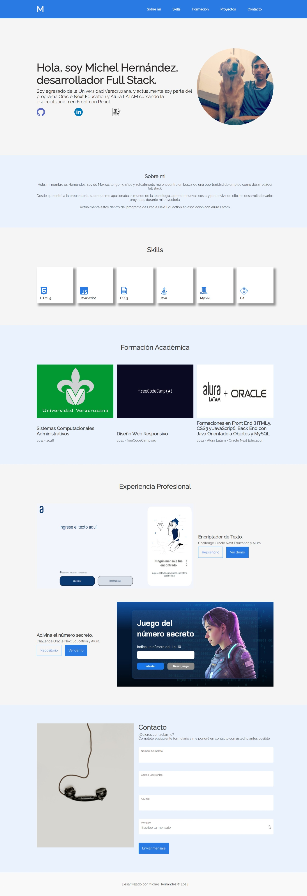

Challenge ONE Encriptador de Texto 🚀
===========
📋 Challenge ONE - Lógica de Programación - Encriptador de Texto.

## Realizado con 🛠️
* HTML
* CSS
* JS
* Figma

La idea principal de este challenge es realizar un portafolio de proyectos en el cual pudieramos poner en práctica todos esos conceptos de programación que hemos aprendido durante este tiempo.

Es importante mencionar la relevancia de tener un portafolio, que actúa como carta de presentación. Destacando habilidades, los proyectos en los que he trabajado y demostrar lo que somos capaces de hacer.

Para el desarrollo del desafío, nos basamos en Figma que usamos como guía.

## Autores ✒️
* **Michel Hdez** - (https://github.com/MichelHdez)